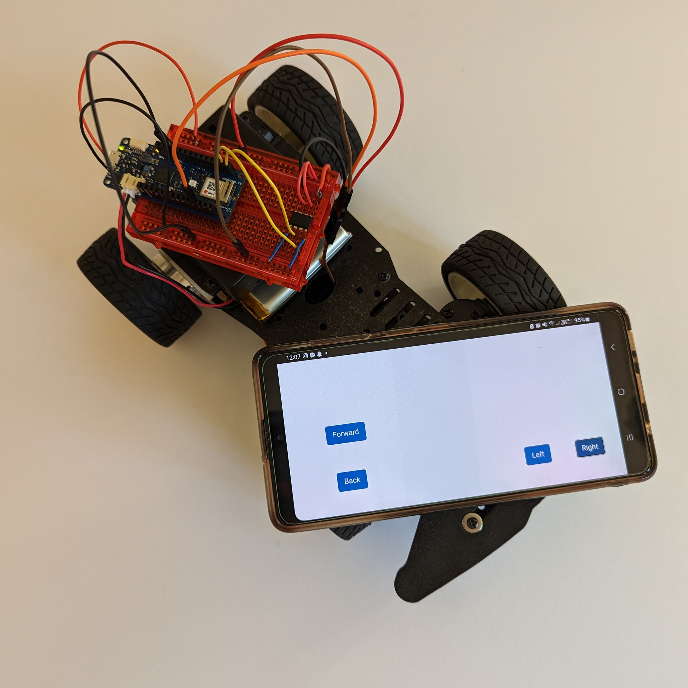

# Wi-Fi Arduino Car

<!-- TABLE OF CONTENTS -->
## Table of Contents

* [About the Project](#about)
  * [Built With](#built-with)
* [Setup](#setup)
* [License](#license)
* [Contact](#contact)
* [Acknowledgements](#acknowledgements)

<!-- ABOUT THE PROJECT -->
## About

This project uses the MKR WiFi 1010, an H-Bridge and a servo motor to control a car through a regular browser (e.g. Chrome, Firefox).
It sets up a simple web server, with the WiFiNINA library, as an interface for the board.

### Built With

* [Arduino MKR WiFi 1010](https://docs.arduino.cc/hardware/mkr-wifi-1010)
* [L9110H H-Bridge Motor Driver](https://cdn-shop.adafruit.com/product-files/4489/4489_datasheet-l9110.pdf)

<!-- GETTING STARTED -->
## Setup

Further information and details can be find the in the [blog post](https://www.engineeracar.com/wifi-arduino-car/) about this project.

<!-- LICENSE -->
## License

Distributed under the MIT License. See `LICENSE` for more information.

<!-- CONTACT -->
## Contact

Halldor Stefansson - [@engineer_a_car](https://twitter.com/engineer_a_car) - halldor@engineeracar.com

<!-- ACKNOWLEDGEMENTS -->
## Acknowledgements

* [Arduino Tutorials - Host a Web Server on the MKR WiFi 1010](https://docs.arduino.cc/tutorials/mkr-wifi-1010/hosting-a-webserver)
* [Instructables - Simple WiFi Controlled RC Car](https://www.instructables.com/Simple-WiFi-Controlled-RC-Car/)
